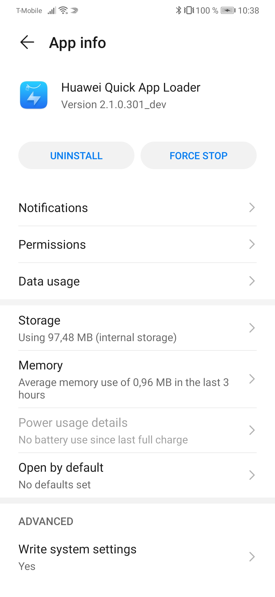
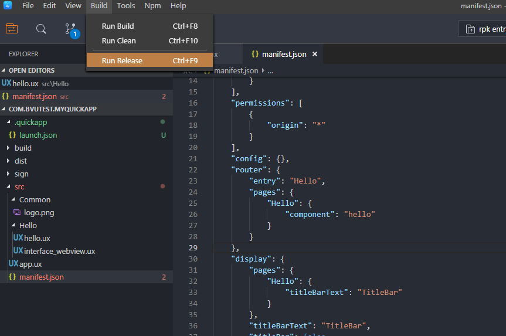
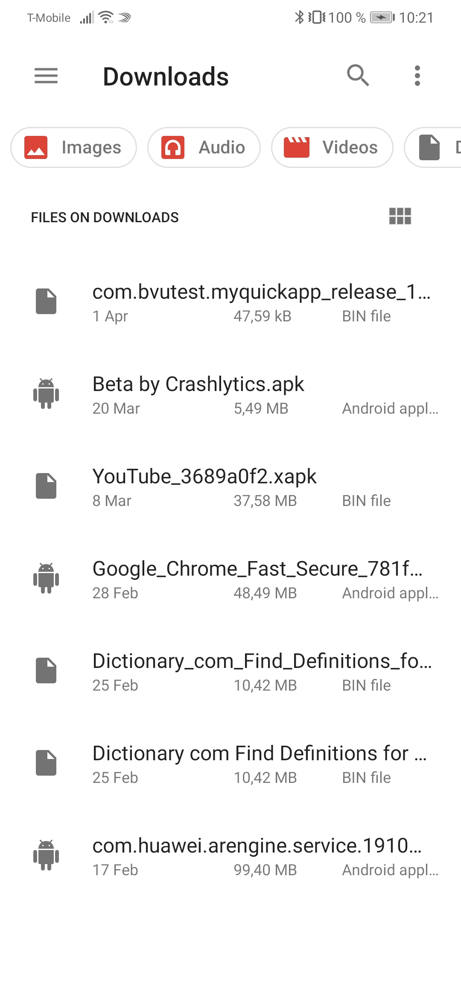

# HuaweiQuickApp-WebviewSample
Huawei Quick App Sample featuring WebView feature

## How to use

### Install Quick App development tools

Follow the instructions on the Huawei Quick App Guide to install the Quick App IDE.
https://developer.huawei.com/consumer/en/doc/development/quickApp-Guides/quickapp-installtool#h1-1578317695350

Make sure to install the Huawei Quick App Loader on the test device.
https://developer.huawei.com/consumer/en/doc/development/quickApp-Guides/quickapp-installtool#h1-1578318207348

### Run on USB connected Device

Ensure that USB connected device has Huawei Quick App Loader installed as well as USB debugging enabled.

### Create and run standalone RPK file

