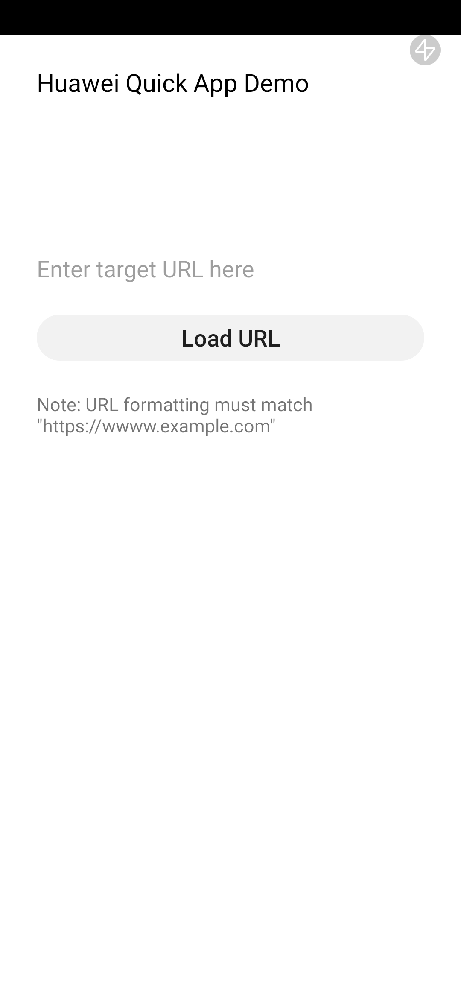
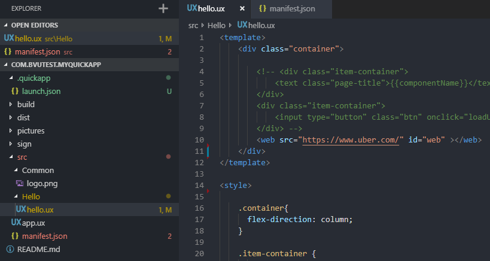

# HuaweiQuickApp-WebviewSample
Huawei Quick App Sample featuring WebView feature

<kbd>
  ! !
</kbd>


RPK download: https://github.com/bryantvu/HuaweiQuickApp-WebviewSample/tree/master/dist

## How to use

### Install Quick App development tools

Follow the instructions on the Huawei Quick App Guide to install the Quick App IDE.
https://developer.huawei.com/consumer/en/doc/development/quickApp-Guides/quickapp-installtool#h1-1578317695350

Make sure to install the Huawei Quick App Loader on the test device.
https://developer.huawei.com/consumer/en/doc/development/quickApp-Guides/quickapp-installtool#h1-1578318207348

### Run on USB connected Device

Ensure that USB connected device has Huawei Quick App Loader installed as well as USB debugging enabled.

<kbd>
  
</kbd>

### Create a standalone RPK file

To build the RPK file, go to Build > Run Release


Press OK to confirm settings and start build.


The RPK file is located in the /dist/ folder found in the root of the project. This file can be shared and run on any test device that has the Huawei Quick App Loader installed. Some email services may block incoming/outgoing emails with attached RPK files, and an alternative file sharing method is recommended.

### Run a standalone RPK file

Connect the test device via USB and ensure that the USB settings have been set to file transfer. Copy the RPK file over to the Downloads folder, launch the Huawei Quick App Loader, and tap the "+" button at the top right.

<kbd>
  
</kbd>

Navigate to the Downloads folder and select the RPK file. The Quick App has been added and is now accessible from the main menu of the Quick App Loader.

<kbd>
  
</kbd>

### Change WebView URL

Change the value of "src" in the <web> object located at the top of the page of /src/Hello/hello.ux to the desired website URL.

```html
<template>
    <div class="container">
        <web src="https://www.uber.com/" id="web" ></web>
    </div>
</template>
```


