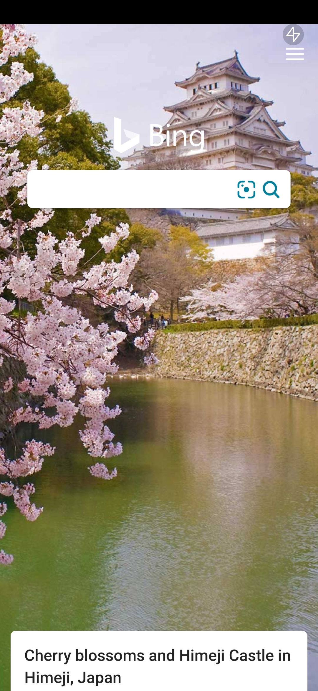
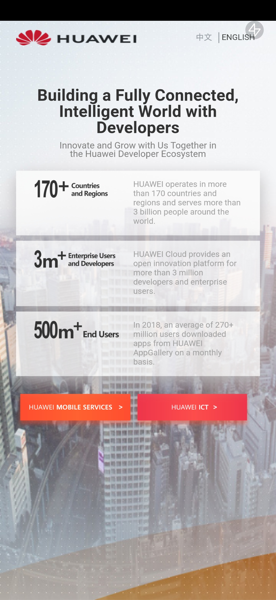
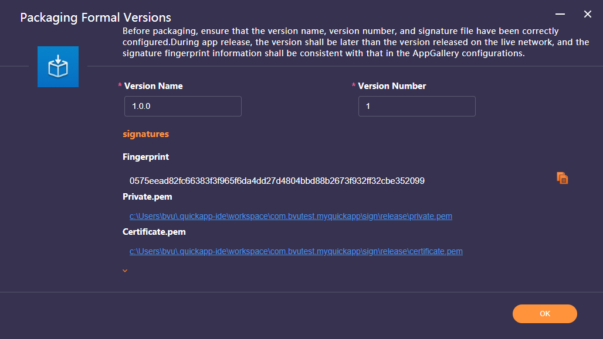
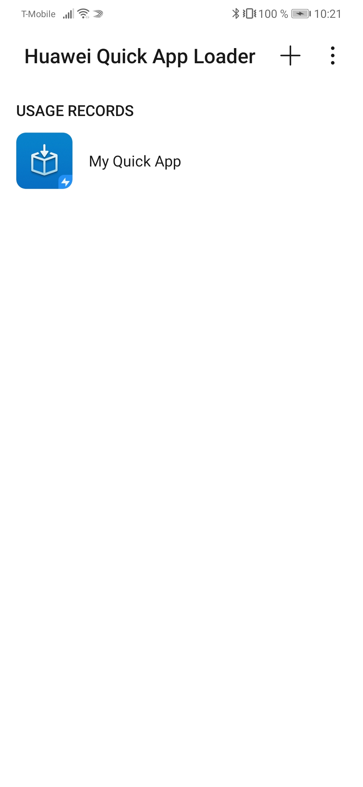
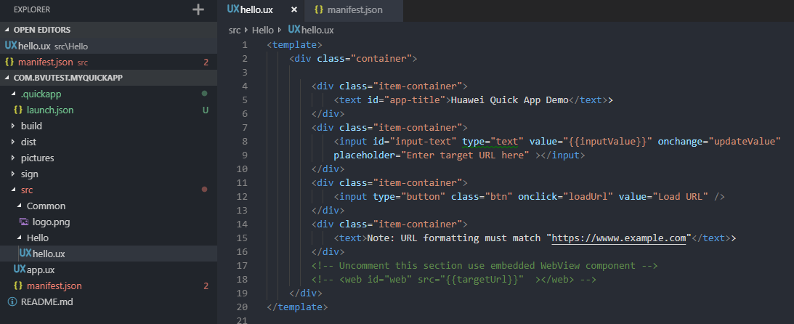
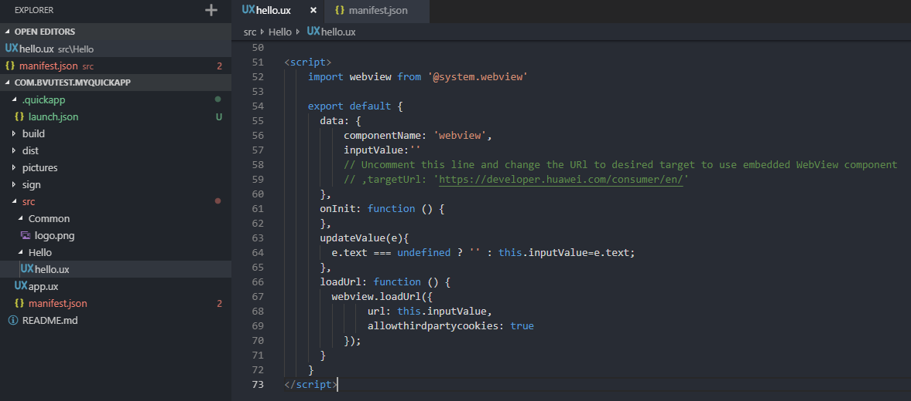

# HuaweiQuickApp-WebviewSample
**Huawei Quick App Sample featuring HTML Web Element feature**

This sample app includes both the HTML web element as well as the webview, but only the web element has been activated. See the instructions below to activate the webview.

The goal here is to try out an exsiting webpage and see how it feels inside of the web element. Use the Bing search to reach your desired webpage.

<kbd></kbd><kbd></kbd>


RPK download: https://github.com/bryantvu/HuaweiQuickApp-WebviewSample/tree/master/dist

## How to use

### Install Quick App development tools

Follow the instructions on the Huawei Quick App Guide to install the Quick App IDE.
https://developer.huawei.com/consumer/en/doc/development/quickApp-Guides/quickapp-installtool#h1-1578317695350

Make sure to install the Huawei Quick App Loader on the test device.
https://developer.huawei.com/consumer/en/doc/development/quickApp-Guides/quickapp-installtool#h1-1578318207348

### Run on USB connected Device

Ensure that USB connected device has Huawei Quick App Loader installed as well as USB debugging enabled.

<kbd>
  
</kbd>

### Create a standalone RPK file

To build the RPK file, go to Build > Run Release


Press OK to confirm settings and start build.



The RPK file is located in the /dist/ folder found in the root of the project. This file can be shared and run on any test device that has the Huawei Quick App Loader installed. Some email services may block incoming/outgoing emails with attached RPK files, and an alternative file sharing method is recommended.

### Run a standalone RPK file

Connect the test device via USB and ensure that the USB settings have been set to file transfer. Copy the RPK file over to the Downloads folder, launch the Huawei Quick App Loader, and tap the "+" button at the top right.

<kbd>
  
</kbd>

Navigate to the Downloads folder and select the RPK file. The Quick App has been added and is now accessible from the main menu of the Quick App Loader.

<kbd>
  
</kbd>

### Embedded Web element vs Webview

This sample implements the web element that is defined in the HTML section of the UX file versus a webview that is loaded programmatically. The web element has the advantage that a developer can control the UI around it, but the URL must be predefined. On the other hand, the webview URL does not need to be predefined and can load a path entered by the user. The downside here is that it loads over the existing page and a developer has little control on the UI around the webview.

The source code includes a section that implements the Webview instead of the embedded web element. To switch to this implementation, uncomment the web object located inside the template at the top of the page of /src/Hello/hello.ux and comment out the rest of the contents within the parent div.

```html
<template>
    <div class="container">

        <!--<div class="item-container">
            <text id="app-title">Huawei Quick App Demo</text>>
        </div>
        <div class="item-container">
            <input id="input-text" type="text" value="{{inputValue}}" onchange="updateValue" 
            placeholder="Enter target URL here" ></input>
        </div>
        <div class="item-container">
            <input type="button" class="btn" onclick="loadUrl" value="Load URL" />
        </div>
        <div class="item-container">
            <text>Note: URL formatting must match "https://wwww.example.com"</text>>
        </div> -->
        <!-- Uncomment this section use embedded WebView component -->
        <web id="web" src="{{targetUrl}}"  ></web>
    </div>
</template>
```



Lastly, change the value of "targetUrl" to the desired website URL. 

```javascript
data: {
          componentName: 'webview',
          inputValue:'',
          targetUrl: 'https://developer.huawei.com/consumer/en/'
      }
```


